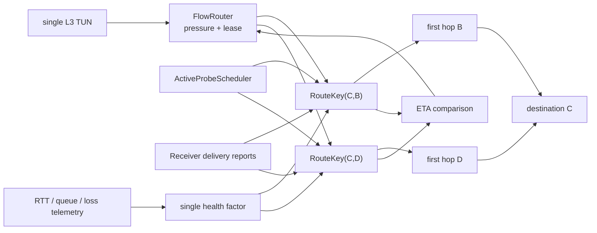

# 测量驱动的 FlowRouter 自适应选路实施计划

## 0. 文档状态

- **状态**：目标方案，等待按阶段实现
- **适用版本**：首次正式发布前
- **兼容策略**：允许配置格式、Presence 格式和内部 wire format 发生破坏性变化；不保留旧带宽声明兼容层
- **当前约束**：每个节点只有一个互联网出口；发布路径仍为 single-path；MultiPath 不在本计划实现范围内
- **核心目标**：默认按延迟选路，持续大流量自动按实测有效容量选路，整个过程对用户和应用透明

---

## 1. 最终决策

删除节点及 Peer 的声明带宽：

```toml
[internet]
upload_mbps = 100
download_mbps = 500
```

删除静态 Peer 中的：

```toml
internet = { upload_mbps = 100, download_mbps = 500 }
```

删除 Presence 中传播的 `upload_mbps/download_mbps`。路由器不再相信节点自报的接入带宽，而是维护每条**本地到目的节点、经指定首跳**的定向实测结果：

```text
RouteKey = (destination_owner, first_hop)
```

例如 A 向 C 发送时分别维护：

```text
(C, B) = A -> B -> ... -> C
(C, D) = A -> D -> ... -> C
```

因此 A 能直接比较 `A -> B -> C` 和 `A -> D -> C` 的完整路径能力，而不只是比较 A 到 B、A 到 D 的第一跳。

带宽数据来自两类观测：

1. **主动探测**：负责新路径、空闲路径和路径变化后的冷启动；
2. **接收端确认的被动交付速率**：负责真实业务期间的持续校准。

两者进入同一个容量估计器。队列增长、RTT 膨胀和丢包不再各自生成复杂路由状态，而是统一折算为一个 `health` 系数。

唯一保留的人工容量字段是可选的本地策略上限：

```toml
[routing]
max_egress_mbps = 80
```

它不是能力声明、不参与 Presence、不影响远端认知，只表示管理员不允许本机 overlay 超过该出口速率。未配置时不设人工上限。

---

## 2. 成功标准

完成后必须同时满足：

1. 配置文件不再要求任何上下行带宽声明；
2. Presence 和静态 Peer 配置不再携带容量字段；
3. 新建或稀疏流默认选择低延迟路线；
4. 同一条普通 TCP/UDP 流持续发送后，无需端口规则即可转向高有效容量路线；
5. 流量停止、压力衰减后重新回到延迟优先；
6. `A -> B -> C` 与 `A -> D -> C` 能分别主动探测并独立维护容量；
7. A 到 B 很快但 B 到 C 很窄时，Bulk 不会因为第一跳很快而错误选择 B；
8. A→C 与 C→A 独立测量，天然支持上下行不对称；
9. 路径发生 direct/iroh relay/DERP 切换后，不继续使用旧路径容量；
10. 有真实 Bulk 业务时停止或显著降低主动探测，优先采用被动交付样本；
11. 主动探测处于最低发送优先级，不明显抬高交互流 p99；
12. `ctl status`、`ctl peers` 和 Prometheus 能解释当前容量、健康度、样本来源、样本年龄和选路原因；
13. 所有 unit、netns、Docker 和真实节点测试不依赖伪造带宽声明。

---

## 3. 当前实现基线与缺口

### 3.1 已经具备、应当保留

- `src/flow_router.rs`
  - 每个流只有衰减压力和短 route lease；
  - ETA 已经将延迟、队列、容量、loss 和切换惩罚放进同一个公式；
  - 持续流量会在 lease 到期后重新选择路线；
  - 没有 SSH、iperf、端口号或应用名称优先级表。
- `src/link_metrics.rs`
  - 已经从 QUIC selected path 采集 RTT、jitter 和 loss delta；
  - loss 已经被转换为 ETA penalty，而不是独立业务状态。
- `src/transport.rs`
  - 已有 priority/bulk 两条本地发送队列；
  - 已有队列字节数、峰值、最大等待时间和过期丢弃计数。
- `src/runtime.rs`
  - 已有单 TUN、逐包 FlowRouter 决策和多跳转发；
  - 已能排除 `previous_peer`，避免立刻把包送回上一跳；
  - 已能读取 iroh/noq 的 selected-path RTT、发送字节、丢包、cwnd 和 MTU。
- `src/observability.rs`、`src/control.rs`
  - 已有 status、peers、ping、trace 和 Prometheus 输出框架。
- `tests/docker-flowrouter/lab.sh`
  - 已有 `A -> {B,D} -> C`、短流、Bulk、并发交互和链路降级测试骨架。

### 3.2 必须替换

- `Config.internet` 是必填项；
- `PeerConfig.internet` 是静态 fallback；
- `PresenceBody.internet` 被签名、传播并展示；
- `route_plan_candidates()` 使用声明值计算容量；
- `LinkEstimator` 没有容量窗口、min RTT、queue delay 和 health；
- 当前 FlowRouter 测试通过人为声明 B=10Mbps、D=500Mbps 来证明 Bulk 选路，不是通过真实链路学习；
- 当前被动统计只有发送/丢包计数，没有端到端接收确认，无法确认 transit 后真正交付了多少字节；
- 当前 selected-path telemetry 属于第一跳，不能单独证明完整多跳路径的瓶颈。

---

## 4. 目标架构



路由核心仍然只有一个比较公式：

```text
ETA = startup_latency
    + 8 * (route_queue_bytes + flow_pressure_bytes) / effective_capacity_bps
    + loss_penalty
    + switch_penalty
```

容量改为：

```text
base_capacity = max(closed_window_max, current_window_max)

effective_capacity = base_capacity * health

if routing.max_egress_mbps is configured:
    effective_capacity = min(effective_capacity, max_egress_mbps)
```

主动探测样本先乘安全系数：

```text
accepted_active_sample = measured_bps * 0.80
```

接收端确认的、非 app-limited 被动样本不打折。

---

## 5. 状态模型

### 5.1 RouteKey

新增：

```rust
pub struct RouteKey {
    pub destination: EndpointId,
    pub first_hop: EndpointId,
}
```

方向由本地节点隐含：A 上的 `(C, B)` 只表示 A→C via B；C→A 由 C 自己维护，不共享同一估计。

直接邻接同样使用该模型：

```text
A -> B direct == RouteKey(destination=B, first_hop=B)
```

不按目的 IP 单独建容量状态。属于同一 owner 的多个 overlay prefix 共享路径估计，避免表规模随前缀或连接增长。

### 5.2 RouteEstimate

参与路由决策的状态保持最小：

```rust
pub struct RouteEstimate {
    pub bw_previous_bps: u64,
    pub bw_current_bps: u64,
    pub min_rtt: Duration,
    pub rtt_ewma: Duration,
    pub loss_ppm: u32,
    pub health_per_mille: u16, // 500..=1000
    pub sample_updated_at: Option<Instant>,
    pub path_epoch: u64,
}
```

以下内容只用于调度和观测，不进入新的路由状态机：

```rust
pub struct ProbeBookkeeping {
    pub in_flight: Option<ProbeId>,
    pub next_due: Instant,
    pub failure_count: u8,
    pub active_samples: u64,
    pub passive_samples: u64,
}
```

UI 中的 `unknown/fresh/stale/probing` 全部由时间戳和 `in_flight` 推导，不在核心估计器里保存额外 enum。

### 5.3 表边界

新增一个有界的 `RouteEstimateTable`：

- key：`RouteKey`；
- 默认上限：4096 条；
- 淘汰：先删除超过 stale TTL 的条目，再删除最久未使用条目；
- 新 candidate 出现时惰性创建；
- owner/Presence 过期时清理相关条目；
- first hop 断开时保留短期历史，但标记不可用；
- selected underlay path 改变时增加 `path_epoch` 并使相关条目立即进入 unknown。

---

## 6. 容量估计器

### 6.1 统一输入

估计器只暴露少量方法：

```rust
observe_active(sample_bps, rtt, loss, now)
observe_passive(delivered_bytes, receiver_interval, app_limited, now)
observe_health(rtt, loss, queue_bytes, now)
rotate_window(now)
invalidate_for_path_change(new_epoch)
snapshot(now) -> CapacitySnapshot
```

主动和被动样本最终都写入：

```text
bw_current = max(bw_current, accepted_sample)
```

### 6.2 app-limited 判定

被动样本满足以下任一条件才进入容量最大值窗口：

```text
route_queue_was_nonempty_for_sample_interval
OR
sample_bps >= current_capacity_estimate
```

第一条表示发送端确实有足够数据；第二条允许短暂但更高的有效样本纠正旧估计。SSH、ping、心跳和小请求不会因为业务本身发得少而降低容量估计。

### 6.3 双窗口最大值与迟滞

窗口建议初值为 2 秒。每次窗口关闭：

```text
if current_window has no valid sample:
    keep previous estimate
else if current_window >= previous_window / 2:
    previous_window = current_window
else:
    previous_window = max(current_window, previous_window * 0.75)

current_window = 0
```

收益：

- 单次 RTT 尖峰或调度停顿不会让容量瞬间腰斩；
- 真实降级仍会在约 3～4 个有效窗口内收敛；
- 新的更高样本可以立即进入当前窗口并被使用。

该部分借鉴 lotspeed `adaptive-accel` 的 `delivered/interval`、app-limited gate 和双窗口迟滞，但不引入其 BBR/FAST/Hybla 状态机。

### 6.4 freshness

建议初值：

```text
fresh: sample age <= 60s
stale: 60s < age <= 180s
expired/unknown: age > 180s
```

- fresh：正常用于 Bulk；
- stale：继续使用，但 health 每个轮换周期缓慢下降并立即安排探测；
- unknown：使用保守 bootstrap capacity，只保证路径仍可供延迟流或唯一可用路线使用；不得把 unknown 当作高容量路线；
- path epoch 改变：不等待 TTL，立即 unknown。

bootstrap capacity 作为内部常量而非用户配置，初始建议 1Mbps。它只负责保证 `capacity == unknown` 时 route candidate 仍可计算，不代表真实容量。

---

## 7. health：队列、RTT 和 loss 的统一折减

### 7.1 基础值

```text
health = 1.0
queue_delay = max(0, rtt_ewma - min_rtt)
```

`min_rtt` 使用长窗口最小值；selected underlay 改变时重置，避免 direct 与 DERP 的基线混用。

### 7.2 快降

满足任一条件时：

- queue bytes 连续两个采样周期增长，并且 queue delay 超过 `max(10ms, min_rtt/4)`；
- loss EWMA 达到 0.5%；
- 主动 probe 超时或有效接收比例过低；
- path 出现 black-hole、连接替换或 send error 突增。

执行：

```text
health = max(0.50, health * 0.85)
```

### 7.3 慢升

连续三个健康窗口满足：

- queue 没有增长；
- queue delay 低于阈值；
- loss EWMA 低于 0.1%；
- 没有 probe failure 或连接异常。

执行：

```text
health = min(1.00, health + 0.02)
```

不再维护独立的“拥塞路由状态”“loss 路由状态”“队列路由状态”。所有压力最终只改变 `effective_capacity` 和现有 `loss_penalty`。

---

## 8. 主动带宽探测

### 8.1 探测对象

主动探测针对 `RouteKey(destination, first_hop)`，不是笼统探测一个 Peer，也不是操作系统默认路由探测。

源节点把 probe 明确送入指定 first hop。中间节点根据 probe 的 destination owner 继续转发，并排除 previous hop。这样才能分别测出：

```text
A -> B -> C
A -> D -> C
```

### 8.2 wire message

新增有严格大小上限的 wire 类型：

```rust
CapacityProbeStart {
    probe_id,
    origin,
    destination,
    packet_count,
    payload_size,
    hop_limit,
}

CapacityProbeReady {
    probe_id,
    traversed_hops,
}

CapacityProbePacket {
    probe_id,
    sequence,
    planned_gap_micros,
    forward_hops,
    payload,
}

CapacityProbeReport {
    probe_id,
    received_packets,
    received_bytes,
    first_to_last_arrival_micros,
    gap_expansion_summary,
    loss_ppm,
    traversed_hops,
}
```

约束：

- 只接受已认证 overlay 邻接发送的 probe；
- `hop_limit` 默认 16，每次转发递减；
- `traversed_hops` 有固定上限并拒绝重复 owner，防止环路；
- report 不得大于 request，避免放大；
- probe payload 不进入 TUN；
- probe 不使用 FEC、repair 或应用层重传，否则会掩盖真实 loss；
- 未知或过期 `probe_id` 的 report 直接丢弃；
- 单节点和单 RouteKey 都限制并发。

`Start/Ready` 同时承担 route RTT 预检：`Start` 按指定 first hop 发出，每个 transit
追加自己的 owner；destination 按记录的 hop list 原路返回 `Ready`。源节点以
`Start -> Ready` 的往返时间更新该 RouteKey 的 RTT，避免只拿第一跳 RTT 代表整条
多跳路线。后续 ProbePacket 使用 Ready 返回的固定 forward hop list，确保同一轮
chirp 不会在下游逐包改路；这只是 probe control source-route，不改变业务数据仍由
各跳 FlowRouter 决策的模型。

### 8.3 探测算法

第一版采用小型 packet-train/chirp，而不是长时间 iperf：

1. 先完成 Start/Ready，确认完整 hop list 并测得 route RTT；
2. 根据已有容量选择一组几何递增目标速率；
3. unknown 路径从保守低速开始；
4. 连续发送固定大小 datagram，逐步缩短 gap；
5. 接收端使用到达间隔膨胀、有效接收字节和接收跨度估算可用速率；
6. 一次调度做 2～3 个短 chirp，取中位值；
7. 最终样本乘 0.80 后进入统一容量窗口。

首版预算目标：

```text
每次 route probe <= 256KiB
持续时间 <= 250ms
全节点同时最多 1 个 probe train
同一 RouteKey 同时最多 1 个 probe
```

具体 packet count、payload 和 rate ladder 由 netns 标定，不暴露为首版用户配置。

### 8.4 调度策略

```text
新 RouteKey：立即探测
unknown：短退避重试
fresh 且空闲：60s 后复测
连续稳定：逐步延长至 2～5min
stale：立即排队复测
path epoch 改变：立即复测
probe 失败：指数退避，上限 5min
```

以下情况跳过或延期：

- 对应 first-hop queue 正在增长；
- 节点存在真实 Bulk 排队；
- 交互队列出现等待；
- 连接处于迁移、重连或 MTU black-hole 恢复中；
- 已有可接受的接收端确认被动样本。

probe 使用独立的最低优先级队列，不能插入现有 priority queue，也不能被统计为用户 Bulk flow。

### 8.5 direct、iroh relay 与 DERP

三者都是某一 overlay adjacency 的 underlay transport，不是新的 overlay 路由节点：

- probe 通过当前 selected underlay 发送；
- report 记录首跳 underlay fingerprint；
- direct/relay/DERP 切换时递增 `path_epoch` 并使旧容量失效；
- DERP 的可靠流可能隐藏 underlay 丢包，但其吞吐、RTT 膨胀和排队仍是实际业务会经历的结果，因此继续参与测量；
- DERP probe 不额外启用 FEC；
- relay 只影响它承载的邻接成本，不出现在 overlay hop list 中。

---

## 9. 接收端确认的被动交付速率

主动探测负责冷路径；繁忙路径最终应由真实交付数据接管。不能直接使用 `tx_bytes / interval`，因为那只是发送量，不等于多跳后送达量。

### 9.1 delivery session

为每个活跃 `RouteKey` 建立短期 delivery session：

```rust
DeliverySession {
    session_id: u64,
    route: RouteKey,
    next_sequence: u32,
    queued_nonempty_since: Option<Instant>,
    last_report: ...,
}
```

session 注册消息携带 origin、destination 和 session id。数据包 wire envelope 增加固定长度的：

```text
delivery_session_id
delivery_sequence
```

中间节点保持这两个字段不变。最终 destination owner 完成 packet reassembly 后才计入 delivered bytes。

### 9.2 聚合 delivery report

目的节点按 session 累计：

```text
delivered_bytes
delivered_packets
duplicate_or_gap_count
receiver_elapsed_micros
```

以下任一条件满足时发送聚合 report：

- 新增交付达到 256KiB；
- 距离上次 report 达到 50ms；
- session 即将过期。

report 返回 origin 时不要求走相同反向路径。速率使用接收端同一单调时钟的 delta：

```text
sample_bps = delta(delivered_bytes) * 8
           / delta(receiver_elapsed)
```

因此不需要节点时钟同步，report 返回路径的延迟变化也不会直接污染带宽样本。

### 9.3 与 app-limited gate 的结合

源节点对同一 report interval 检查该 route 的真实待发送队列：

- 队列持续非空：样本有效；
- 队列中途为空：仅当样本不低于当前估计时接受；
- session/route/path epoch 不匹配：丢弃；
- report 跨越 route switch：丢弃。

### 9.4 开销边界

- 不逐包 ACK；只发聚合 report；
- session 表和 receiver report 表都必须有 TTL 和总量上限；
- control report 进入 priority queue，但必须做每 session 和全局速率限制；
- session id 不作为安全身份，身份仍来自已认证的 overlay connection；
- 数据包额外 header 的字节数在实现前用 MTU/fragmentation 测试确认，必要时合并现有 reserved/sequence 字段。

---

## 10. FlowRouter 行为

### 10.1 不新增业务分类状态机

保留现有 pressure 模型：

```text
pressure = max(0, previous_pressure - drain_rate * elapsed)
         + max(0, packet_len - packet_allowance)

demand = pressure + flow_queued_bytes
```

不增加：

- SSH/HTTP/iperf 识别；
- well-known port 表；
- `New -> Interactive -> Bulk -> Recovery` 状态；
- DPI；
- 用户 DSCP 配置要求。

本地 priority/bulk queue 仍由当前 `demand < LATENCY_PRESSURE_LIMIT` 动态推导。这是瞬时派生值，不存储为 flow mode。

### 10.2 unknown 容量

容量未知不等于路线不可用：

- demand 接近 0 时仍按 latency 选择；
- Bulk 评分使用保守 bootstrap capacity；
- 唯一路线即使 unknown 也可发送；
- probe scheduler 立即补测；
- unknown 路线不得因为未测量而被当成无限容量。

### 10.3 防抖

继续使用：

- flow lease；
- switch penalty；
- estimator 双窗口迟滞；
- health 快降慢升。

不再增加额外 route hold state。只有 selected underlay 的 direct/relay hold-down 保留在 `WanPathSelector`，因为它解决的是连接迁移而非业务选路。

---

## 11. 配置、Presence 和 CLI 破坏性修改

### 11.1 `src/config.rs`

删除：

- `InternetBandwidth`；
- `Config.internet`；
- `PeerConfig.internet`；
- 相关 `upload_bps/download_bps/validate`；
- 所有初始化默认值和测试 fixture。

在 `RoutingConfig` 增加：

```rust
pub max_egress_mbps: Option<u64>
```

校验：非零、乘 1,000,000 不溢出。该配置只在本机生效。

### 11.2 `src/mesh.rs`

删除：

- `PresenceBody.internet`；
- signing bytes 中的 upload/download；
- `MeshNodeStatus.internet`。

因为不考虑兼容，直接将 domain/version 更新为 Presence v3，旧 Presence 必须校验失败，避免不同字段布局被误解释。

### 11.3 `src/main.rs`

删除：

- init 命令的 upload/download 参数和交互提问；
- inspect/config 输出中的 internet upload/download；
- mesh node 输出中的声明带宽。

如提供 `--max-egress-mbps`，其语义必须明确为本地 policy cap，默认不询问，保持零配置自动测量。

### 11.4 示例和文档

修改：

- `config/example.toml`；
- `README.md`；
- 所有 netns/Docker fixture；
- NixOS module 中可能暴露的配置项；
- 安装和 init 输出示例。

不得留下“声明带宽作为 fallback”的隐式路径。

---

## 12. 代码组织与文件级任务

### 12.1 新增模块

建议新增：

```text
src/capacity.rs
    RouteKey
    RouteEstimate
    RouteEstimateTable
    capacity window / health / freshness

src/capacity_probe.rs
    probe codec payload types
    ActiveProbeScheduler
    receiver aggregation
    probe validation and budgets

src/delivery.rs
    DeliverySession
    receiver-confirmed report aggregation
    app-limited gate bookkeeping
```

避免继续扩大已经承担连接、转发、FEC、mesh 和 telemetry 的 `src/runtime.rs`。

### 12.2 修改模块

| 文件 | 修改目标 |
|---|---|
| `src/config.rs` | 删除声明带宽，增加可选本地出口 cap |
| `src/mesh.rs` | Presence v3，删除带宽字段和状态输出 |
| `src/wire.rs` | 接入 probe/delivery wire type，更新 data envelope，严格长度校验 |
| `src/link_metrics.rs` | 保留第一跳 RTT/jitter/loss 原始估计；增加 min RTT/queue-delay 输入或拆到 `capacity.rs` |
| `src/flow_router.rs` | 支持 measured/unknown capacity snapshot；保留 pressure+lease 模型 |
| `src/runtime.rs` | 构造 RouteKey、调度 probe、处理 report、用实测容量生成 candidate |
| `src/transport.rs` | 新增最低优先级 probe queue，暴露 route queue busy interval |
| `src/observability.rs` | route estimate/probe/passive metrics 和 status schema |
| `src/control.rs` | status/peers 输出新增容量解释字段；必要时增加只读 `routes` 子命令 |
| `src/main.rs` | 删除声明参数和输出，展示 policy cap |
| `README.md` | 改写 routing model、架构图和配置说明 |

### 12.3 并发与锁

- FlowRouter packet hot path 不等待 probe I/O；
- `RouteEstimateTable` 使用短临界区同步快照，probe/report 通过 bounded channel 投递更新；
- probe scheduler 不持 Peer connection 锁等待 timer；
- status snapshot 不持锁执行文件或网络 I/O；
- receiver report 表分片或单任务所有，避免每包抢全局 async mutex；
- 所有 channel 和表必须有显式上限。

---

## 13. 分阶段实施

### Phase 0：冻结基线

- [ ] 运行 `cargo fmt --check`、`cargo clippy --all-targets --all-features`、`cargo test --all-targets`；
- [ ] 运行现有 `tests/docker-flowrouter/run.sh` 并保存基线结果；
- [ ] 记录当前 short-flow RTT、Bulk throughput、ping p50/p99、probe/heartbeat 开销；
- [ ] 确认当前工作区未提交改动的归属，实施期间不覆盖无关修改。

**退出条件**：现有行为可复现，失败项被明确记录而非混入新方案。

### Phase 1：容量估计器纯逻辑

- [ ] 新增 `capacity.rs`；
- [ ] 实现 RouteKey、双窗口、active 折扣、app-limited gate；
- [ ] 实现 health 快降慢升；
- [ ] 实现 freshness、path epoch invalidation 和有界表；
- [ ] 用 unit tests 固定全部数学边界；
- [ ] 暂不接入运行时选路。

**退出条件**：估计器完全由 deterministic tests 覆盖，不依赖真实时间 sleep。

### Phase 2：主动 route probe

- [ ] 定义 probe wire format 和严格解码上限；
- [ ] 实现指定 first hop 的转发；
- [ ] 实现 hop limit、loop detection、report reverse/return；
- [ ] 实现 receiver arrival measurement；
- [ ] 实现 scheduler、流量预算、busy skip 和退避；
- [ ] 把 probe 样本写入 RouteEstimateTable；
- [ ] 路径 transport/fingerprint 改变时 invalidation；
- [ ] 暂时只在 observability 展示，不替换 declared capacity。

**退出条件**：netns 中能同时看到 `(C,B)` 约 10Mbps、`(C,D)` 约 100Mbps，且不依赖配置声明。

### Phase 3：接收端确认的被动测量

- [ ] 定义 delivery session 和 data envelope；
- [ ] 实现中间节点透明保留 session/sequence；
- [ ] 实现 destination 聚合 report；
- [ ] 实现 source queue-busy/app-limited 判定；
- [ ] report 写入同一估计器；
- [ ] 有有效 Bulk 被动样本时暂停主动 probe；
- [ ] 测量 wire overhead、CPU 和 report 比率。

**退出条件**：长流运行时 capacity 主要由 passive samples 更新，停止业务后 active probe 能继续维护冷路径。

### Phase 4：切换 FlowRouter 到 measured capacity

- [ ] `route_plan_candidates()` 改用 RouteEstimateTable；
- [ ] candidate 延迟优先使用 route probe RTT，缺失时回退第一跳 live RTT；
- [ ] candidate 容量使用 effective capacity；
- [ ] unknown 使用保守 bootstrap；
- [ ] 应用可选 `max_egress_mbps`；
- [ ] 保留现有 pressure、lease、switch penalty；
- [ ] 添加选路 reason/cost component 调试日志。

**退出条件**：物理 10Mbps/100Mbps 双路测试中，短流走低 RTT，持续流自动走 100Mbps。

### Phase 5：删除声明模型

- [ ] 删除 Config/PeerConfig/Presence 中的带宽；
- [ ] Presence 升级 v3；
- [ ] 删除 init/inspect/mesh status 的声明字段；
- [ ] 删除 runtime 的 `declared_internet` 和 capacity fallback；
- [ ] 删除 Prometheus 的 declared upload/download；
- [ ] 清理所有测试配置；
- [ ] 更新 README、example config、NixOS module。

**退出条件**：仓库中搜索不到用于路由的 `upload_mbps/download_mbps/InternetBandwidth`。

### Phase 6：可观测性和运维闭环

- [ ] status 输出 route estimate 列表；
- [ ] peers 输出第一跳 live telemetry；
- [ ] Prometheus 输出 capacity/health/freshness/probe/passive counters；
- [ ] `ctl status` 展示全局 probe budget 和 estimate table 使用量；
- [ ] 选路切换日志包含 old/new route、demand、RTT、capacity、health、queue 和 penalty；
- [ ] 日志 rate limit，避免长流 lease 到期时刷屏。

**退出条件**：不抓包、不打开 debug 日志也能回答“为什么这个流选 B/D”。

### Phase 7：完整验证与参数冻结

- [ ] unit tests；
- [ ] netns dual-transit；
- [ ] Docker direct/relay/DERP；
- [ ] IPv4/IPv6；
- [ ] 正反方向不对称；
- [ ] 链路限速动态变化；
- [ ] loss/queue/bufferbloat；
- [ ] underlay migration；
- [ ] 多小时 soak；
- [ ] CPU、内存、probe bytes 和 wire overhead 统计；
- [ ] 根据结果冻结首版常量，不提前增加大量配置旋钮。

---

## 14. 测试计划

### 14.1 单元测试

#### capacity estimator

- active sample 正确乘 0.80；
- passive non-app-limited 样本不打折；
- app-limited 低样本被忽略；
- app-limited 新高样本被接受；
- 当前窗口取最大值；
- 正常窗口直接推进；
- 塌陷窗口只衰减 25%；
- 无样本窗口保留；
- stale/expired 边界；
- health 下限 0.50、上限 1.00；
- queue/loss 快降；
- 健康窗口慢升；
- path epoch 改变清空旧容量和 min RTT；
- table TTL/LRU 上限。

#### probe codec/scheduler

- 所有消息 round-trip；
- 截断、超长、超 packet count、超 hop list 拒绝；
- 重复 hop 拒绝；
- hop limit 正确递减；
- report 不放大；
- unknown probe id 丢弃；
- 全局/单 route 并发限制；
- busy queue 跳过；
- failure backoff；
- timer 使用注入 clock，测试不 sleep。

#### delivery

- session 注册/过期；
- cumulative report delta；
- duplicate sequence 不重复计费；
- out-of-order 正确计数；
- receiver elapsed 为零拒绝；
- route/path epoch 不匹配拒绝；
- app-limited interval gate；
- report 聚合和速率限制。

#### FlowRouter

- 新短流选择低 RTT unknown route；
- 测得容量后大 demand 选择高容量 route；
- health 下降导致 Bulk 改路；
- lease 内不逐包抖动；
- lease 到期允许切换；
- idle flow 重置 pressure；
- 唯一 unknown route 仍可用；
- optional egress cap 生效。

### 14.2 netns 集成拓扑

沿用：

```text
A -> B -> C   低 RTT，10Mbps
A -> D -> C   高 RTT，100Mbps
```

但完全删除配置带宽声明，只用 `tc netem/tbf` 塑造真实链路。

必须证明：

1. probe 分别获得 via B、via D 的不同结果；
2. 4KiB echo/SSH-like 流量主要走 B；
3. 单条普通 iperf 流增长后主要走 D；
4. Bulk 运行时 ping p99 保持目标范围；
5. reverse iperf 由 C 自己的定向估计选择；
6. 把 B 从 10Mbps 改到 150Mbps 后，估计和 Bulk 选路收敛；
7. 把 D 从 100Mbps 降到 5Mbps 后，迟滞不会永久保留旧容量；
8. B 第一跳 100Mbps、B→C 只有 5Mbps 时，route probe 能识别完整路径瓶颈；
9. probe 期间 priority queue 延迟没有明显尖峰；
10. 断开/reconnect 后旧 path epoch 不再生效。

### 14.3 underlay 测试

- direct UDP；
- iroh relay；
- DERP；
- direct → relay/DERP failover；
- relay/DERP → direct 恢复；
- IPv6-only first hop；
- NAT 下地址变化。

每次切换必须观察：

```text
path_epoch increases
old capacity becomes unknown
new probe scheduled
latency traffic remains usable
Bulk waits for or conservatively uses new estimate
```

### 14.4 性能和稳定性

- 1、100、1000 个活跃 flow；
- 4096 RouteEstimate 上限；
- 8MiB outbound queue 接近满载；
- 24 小时 probe scheduler soak；
- Presence churn；
- control report 丢失；
- 5% loss 和高 jitter；
- 低 MTU/fragmentation；
- FEC on/off；
- status reporter 写文件失败不影响数据面。

---

## 15. 可观测性目标

### 15.1 status JSON

新增 route 级别结构：

```json
{
  "destination": "ENDPOINT_ID",
  "first_hop": "ENDPOINT_ID",
  "capacity_bps": 84200000,
  "effective_capacity_bps": 71570000,
  "health_per_mille": 850,
  "rtt_micros": 42000,
  "min_rtt_micros": 36000,
  "loss_ppm": 1200,
  "sample_age_millis": 4300,
  "freshness": "fresh",
  "active_samples": 3,
  "passive_samples": 91,
  "probe_in_flight": false,
  "path_epoch": 4
}
```

`freshness` 是展示层派生值。

### 15.2 Prometheus

新增建议：

```text
ironet_route_capacity_bits_per_second
ironet_route_effective_capacity_bits_per_second
ironet_route_health_ratio
ironet_route_rtt_microseconds
ironet_route_min_rtt_microseconds
ironet_route_sample_age_seconds
ironet_route_active_samples_total
ironet_route_passive_samples_total
ironet_route_probe_attempts_total
ironet_route_probe_failures_total
ironet_route_probe_bytes_total
ironet_route_switches_total
ironet_capacity_table_entries
ironet_capacity_probe_inflight
```

删除：

```text
ironet_mesh_node_upload_bits_per_second
ironet_mesh_node_download_bits_per_second
```

### 15.3 CLI

`ctl peers` 重点展示第一跳连接健康：

```text
peer / connected / transport / RTT / queue / loss / path_epoch
```

`ctl status` 增加 route estimate 摘要：

```text
destination / via / capacity / effective / health / age / samples
```

如果 route 数量较多，再增加只读：

```text
ctl routes [--destination ...] [--output json]
```

不在首版增加手工“指定应用优先级”或“强制 Bulk”命令。

---

## 16. 风险与控制

| 风险 | 影响 | 控制措施 |
|---|---|---|
| probe 抬高交互延迟 | SSH/ping 抖动 | 最低优先级、全局单 probe、queue busy skip、严格字节预算 |
| 用户态 timer 精度不足 | 高速链路估计偏差 | receiver arrival 分析、重复取中位、分档 chirp、主动样本 0.80 折扣 |
| QUIC CC 限制 probe | 冷启动低估 | 把结果视为当前可实现吞吐；稳定后复测；真实 Bulk 被动样本接管 |
| 只测第一跳 | 多跳选错 | RouteKey 包含 destination+first_hop，probe 必须到最终 owner |
| report 反向路径不同 | ACK 间隔污染 | 用 receiver monotonic elapsed delta，不用 report arrival delta |
| 旧 direct 容量用于 DERP | Bulk 严重误选 | underlay fingerprint/path epoch 变化立即 invalidation |
| downstream route 改变 | RouteKey 对应实际路径变化 | report 返回 bounded hop digest；短 freshness TTL；定期复测 |
| probe 被利用放大 | 控制面/带宽消耗 | authenticated peer、固定预算、hop limit、report 不大于 request、全局限速 |
| delivery header 增大 | MTU/fragmentation 增加 | 固定紧凑 header、与现有 sequence/reserved 合并、低 MTU 测试 |
| app-limited 误判 | 容量被 SSH 降低 | route queue busy interval gate；低样本忽略，高样本允许纠偏 |
| 长时间无样本保留旧容量 | 真实降速后误选 | freshness/expiry、stale health decay、主动复测 |
| active 与 passive 相互打架 | 估计抖动 | 同一双窗口；active 折扣；最大值窗口；health 快降慢升 |
| 状态表失控 | 内存增长 | RouteKey 以 owner 而非 IP/flow 为粒度，4096 上限、TTL/LRU |

---

## 17. 明确不做

本计划不实现：

- MultiPath 并行分流；
- 多互联网出口；
- Babel 兼容或 Babel metric 翻译；
- 节点声明容量 fallback；
- 按端口、协议、进程或业务名称配置优先级；
- DPI；
- lotspeed 的 BBR/FAST/Hybla 拥塞控制；
- KNN/机器学习参数搜索；
- NeoQ 四档 WRR 状态机；
- 把 DERP 当 overlay transit node；
- 首版向用户开放大量探测参数。

MultiPath 不在当前范围内；现有单路径模型不预留 dormant vector、aggregate capacity、reorder penalty 或调度 sequence。若未来确有需求，再以端到端语义和实测收益为前提单独设计。

---

## 18. 完成定义（Definition of Done）

只有满足以下全部条件才算完成：

- [ ] 配置、Presence、CLI、状态和文档已彻底删除声明上下行带宽；
- [ ] 主动 probe 能按 `(destination, first_hop)` 测量完整多跳路径；
- [ ] 被动容量来自 destination receiver-confirmed delivery，不是单纯 tx rate；
- [ ] app-limited 小流不会拉低容量；
- [ ] 双窗口迟滞、health、freshness 和 path epoch 均有 deterministic unit tests；
- [ ] 默认低延迟、持续流高容量的行为在真实 `tc` 限速拓扑中成立；
- [ ] 正反方向独立测量成立；
- [ ] direct/relay/DERP 切换不会复用旧估计；
- [ ] probe 对交互 p99 和业务吞吐的影响在验收阈值内；
- [ ] 所有表、channel、payload、并发和重试都有硬上限；
- [ ] `ctl` 和 Prometheus 可以解释每次重要选路；
- [ ] `cargo fmt --check`、Clippy、unit、netns、Docker 和 soak 全部通过；
- [ ] README 描述与实际实现一致，没有声明容量 fallback 或旧协议残留。

---

## 19. 实施顺序摘要

```text
容量估计器纯逻辑
    ↓
指定 first-hop 的端到端主动 probe
    ↓
receiver-confirmed 被动交付报告
    ↓
FlowRouter 改用 measured effective capacity
    ↓
删除 Config/Presence 声明带宽
    ↓
补齐 status/ctl/Prometheus
    ↓
netns + relay/DERP + soak 验收
```

最先证明的关键事实不是“代码已经删除声明字段”，而是：

> 在没有任何带宽声明的 `A -> {B,D} -> C` 拓扑中，系统能够测出两条完整路径的容量差异，并让短流选择低延迟路线、持续流选择高有效容量路线。

如果这个 proof point 不成立，应停止删除声明模型后的外围清理，优先修正 probe attribution、delivery measurement 或 route scoring，而不是增加更多业务状态和配置旋钮。
