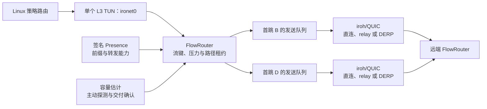

# Ironet

`ironet` 是运行在 Linux 上的三层加密覆盖网络。它使用 iroh/QUIC 建立经认证的节点邻接关系，在单个 TUN 接口上处理覆盖网流量，并通过 FlowRouter 按实时路径状态选择首跳。

当前软件版本为 `0.1.0`，当前网络协议正式定位为 **Ironet Protocol V1（1.0）**。协议分层、兼容边界和稳定性规则见 [Protocol V1](docs/protocol-v1.md)。配置格式、Presence 格式和内部 wire format 在首次稳定发布前可能发生不兼容变更。

## 项目范围

- 每个守护进程创建并管理一个三层 TUN 接口，默认名称为 `ironet0`。
- 节点使用签名 Presence 传播节点地址、前缀归属和转发能力；固定 peer 用于引导连接。
- 同一流在短租约内固定到一条路径；租约到期后可根据延迟、抖动、丢包、队列压力和实测容量重新选择路径。
- 容量以 `(目的节点所有者, 首跳节点)` 为键，分别维护两个方向的测量值。主动探测和接收端确认的业务交付样本共同参与估计。
- 默认通过固定 bootstrap peer 交换签名 Presence 和 peer 观察到的 NAT 地址候选，优先建立直连 UDP；失败时由普通 transit peer 做覆盖层转发，不依赖公共 iroh relay。
- 直连 UDP、可选 iroh relay 和 DERP 都是节点邻接的底层传输；覆盖层的转发和选路仍由 FlowRouter 处理。
- 守护进程以 `CAP_NET_ADMIN` 运行；操作命令通过 Unix 控制套接字访问守护进程。

当前约束：仅支持 Linux；每个节点按单一互联网出口建模；每条流在一个租约内只使用一条覆盖路径；未实现多路径发送。

## 架构



FlowRouter 的候选路径比较包含以下因素：

```text
ETA = RTT + 抖动 + 丢包惩罚
    + 8 × (候选路径队列字节数 + 流压力字节数) / 方向容量
    + 切换惩罚
```

新建或稀疏流通常优先选择低延迟路径；持续流量会累积压力，并在租约到期后重新比较路径。该过程不依赖端口、协议或应用类型的优先级表。

## 安装与首次运行

运行节点需要：

- Linux 主机、`/dev/net/tun` 和 `iproute2`；
- 启用 systemd 服务时，需要 systemd、`systemd-sysusers` 或等价的系统用户管理工具；
- 守护进程需要 `CAP_NET_ADMIN`；运行 `doctor`、初始化和服务管理命令通常使用 `sudo`。

Debian 包安装：

```bash
sudo dpkg -i ./ironet_0.1.0_amd64.deb
```

从源码安装：

```bash
nix develop -c cargo build --locked --release
sudo scripts/install.sh
```

首次节点使用交互式初始化。第一个节点不传入 `--network-id`，命令会生成并输出网络 ID；其余节点传入相同的值。

```bash
sudo ironet init \
  --config /etc/ironet/config.toml \
  --state-dir /var/lib/ironet

sudo ironet init \
  --config /etc/ironet/config.toml \
  --state-dir /var/lib/ironet \
  --network-id "第一个节点输出的网络 ID"
```

初始化后，根据部署拓扑补充地址、前缀和引导 peer。每次手工修改配置后都必须重新生成完整性摘要：

```bash
sudo ironet validate --config /etc/ironet/config.toml
sudo ironet seal-config --config /etc/ironet/config.toml
sudo systemctl enable --now ironet
```

两节点静态示例、配置字段说明和配置变更方式见 [快速开始](docs/快速开始.md) 与 [配置参考](docs/配置参考.md)。

## 日常操作

```bash
sudo ironet health
sudo ironet status
sudo ironet peers
sudo ironet tui
sudo ironet ping 21.0.0.3
sudo ironet trace 21.0.0.3
sudo ironet route add 192.168.30.0/24 --owner branch-c
sudo ironet route import ./site-routes.txt
sudo ironet route list
sudo ironet route remove 192.168.30.0/24
sudo ironet reload
```

静态远端路由由 CLI 原子写入 `identity_file` 同目录的 `routes.toml`（默认
`/var/lib/ironet/routes.toml`），不会混入或重写 `config.toml`。导入和删除
在守护进程运行时会自动 reload；`--dry-run` 可预览，维护窗口可加 `--defer`
延后应用。

`status`、`peers`、`ping` 与 `trace` 支持 `--output human|json|jsonl`（`status` 也保留 `--json`）。Human 输出会按量级展示时间、字节数和速率（例如 `1m30s`、`1.5MB/s`、`1.5Mbit/s`）；JSON/JSONL 始终保留原始基础单位，适合脚本处理。`tui` 是交互式运维台，`Tab` 可切换 Peer、Routes、Diagnostics 三个视图：查看实时链路，在 Routes 中按 `a` 接受或按两次 `x` 移除持久路由，在 Diagnostics 中直接对所选节点执行 ping/trace；任意视图按两次 `R` 可校验并 reload 守护进程。原 `top` 命令保留为兼容别名。

服务、监控、配置更新、备份与排障命令见 [运行与运维](docs/运行与运维.md)。

## 文档

- [文档索引](docs/README.md)
- [快速开始：两节点静态拓扑](docs/快速开始.md)
- [配置参考](docs/配置参考.md)
- [运行与运维](docs/运行与运维.md)
- [开发与测试](docs/开发与测试.md)
- [架构与路由模型](docs/架构与路由模型.md)
- [实施计划](PLAN.md)

## 开发

```bash
nix develop -c cargo fmt --check
nix develop -c cargo test --locked
nix develop -c cargo clippy --locked --all-targets -- -D warnings
nix build
```

网络集成测试需要 Docker、`/dev/net/tun` 和特权网络命名空间：

```bash
tests/netns/run-all.sh
```

详细的测试矩阵、打包和发布步骤见 [开发与测试](docs/开发与测试.md)。提交规范见 [CONTRIBUTING.md](CONTRIBUTING.md)。

## 目录结构

```text
.
├── src/          Rust 代码；CLI、守护进程、转发与传输实现
├── config/       可直接复制后修改的配置示例
├── systemd/      systemd unit、sysusers 与 sysctl 配置
├── nixos/        NixOS 模块
├── scripts/      安装、卸载、Debian 打包与发布脚本
├── tests/        单元测试、网络命名空间集成测试和真实网络测试
├── docs/         面向使用者和维护者的文档
└── .forgejo/     Forgejo CI 与发布工作流
```

## 许可

本项目同时采用 [MIT](LICENSE-MIT) 和 [Apache-2.0](LICENSE-APACHE) 许可。使用者可任选其一。
