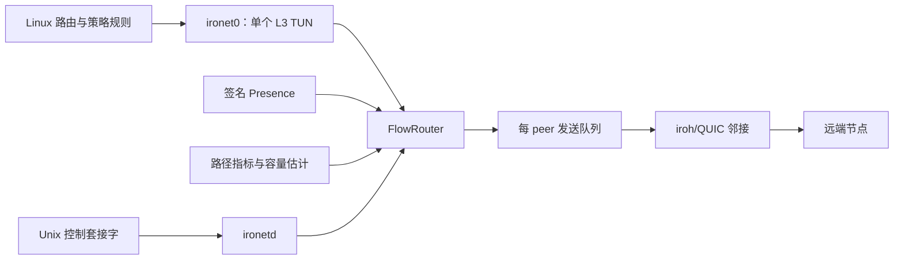

# 架构与路由模型

## 组件边界



- `ironetd`：特权守护进程。创建 TUN、维护 Linux 策略路由、管理 peer 连接并收发覆盖数据包。
- `ironet`：操作 CLI。通过 Unix 套接字查询状态、执行 ping/trace 和请求热重载。
- FlowRouter：每个数据包只从 TUN 读取一次，生成方向性流键，并在可达候选首跳中选择一个路径。
- Presence：在认证 peer 间传播节点、前缀和转发能力。动态前缀只在对应 Presence 仍有效时写入策略路由。
- 声明 LAN/服务前缀的节点默认对覆盖网入站流量执行源 NAT；可通过 `routing.nat_enabled = false` 切换为保留端到端源地址的纯路由模式。

不需要外部路由守护进程，也不会为每个 peer 创建独立 TUN。

## 路径选择

每个节点邻接可以同时保留 IPv4、IPv6 和 relay 候选路径。底层路径选择先比较
黑洞记录、丢包和 RTT；质量接近时使用 `[path_selection].prefer`，默认优先
IPv6。一次只激活一条底层路径，未选路径继续作为切换候选。Overlay FlowRouter
随后在已建立的节点邻接之间选择首跳，这两个选择层次相互独立。

每个流使用以下短期状态：

1. 衰减的字节压力；
2. 路径租约。

流键由源 IP、目的 IP、IP 协议，以及存在时的 TCP/UDP 源端口和目的端口组成。FlowRouter 不维护基于应用、端口或协议名称的长期优先级表。

候选路径比较使用：

```text
ETA = RTT + 抖动 + 丢包惩罚
    + 8 × (候选路径队列字节数 + 流压力字节数) / 方向有效容量
    + 切换惩罚
```

这产生以下运行行为：

- 新建或低流量流通常选择 RTT 较低的路径；
- 持续发送会提高该流压力，租约到期后可能转向有效容量较高的路径；
- 队列长度参与估算，但不会把流量固定标为“交互”或“Bulk”；
- 租约阻止逐包切换；
- 对同一流，一个租约内只激活一条路径。

## 容量估计

容量按本地发送方向和完整路由维护：

```text
RouteKey = (目的节点所有者, 首跳)
```

例如节点 A 到节点 C 可同时维护：

```text
(C, B) = A → B → … → C
(C, D) = A → D → … → C
```

因此 A 比较的是完整路径的测量结果，而不是只比较 A→B 与 A→D 的首跳带宽。A→C 和 C→A 由各自发起方独立维护，天然支持不对称链路。

测量来源：

- **主动探测**：用于新路径、空闲路径和底层路径变化后的冷启动。探测全局单飞、有限大小，且优先级低于业务队列。
- **被动交付样本**：由最终接收端确认真实业务到达，持续校准完整路径能力。新鲜的被动样本会抑制主动探测。

估计值还会考虑 RTT、抖动、丢包、队列增长、样本新鲜度和路径健康度。底层直连、DERP 或覆盖中转发生切换时，首跳路径 epoch 增加，旧测量立即失效并回到保守的冷启动估计。显式启用 iroh relay 时，其路径切换遵循相同规则。

`routing.max_egress_mbps` 仅是本机策略上限，最后应用于有效容量；它不在 Presence 中传播，也不是链路能力声明。

## 队列与发送顺序

每个已选 peer 有延迟队列和 Bulk 队列，共享字节上限：

- 新到达的延迟数据包可以挤出 Bulk 数据包；Bulk 只会替换更早的 Bulk 数据包。
- 大于 4 KiB 的 TUN 数据包直接进入 Bulk 队列，避免大报文首段占用延迟队列。
- 分片 Bulk 报文在 wire datagram 间可以被控制或延迟工作抢占，之后继续发送。
- 预路由 FIFO 和 QUIC 不可抢占的数据报缓冲保持较浅，限制低优先级流量对延迟工作的阻塞。

这些队列规则是发送端短期调度机制，不改变 FlowRouter 的流分类模型。

## 多跳与中转

目的所有者已直接连接时，FlowRouter 选择直接 peer。否则它只比较允许中转的已连接 peer：来自有效 Presence 或固定配置的 `transit_enabled = true`。

中转节点在用户态转发数据包，并执行两项约束：

1. 排除刚刚接收该包的 peer，避免立即回送；
2. IPv4 TTL 或 IPv6 hop limit 减一。

本节点的 `[routing].transit_enabled` 控制本节点是否在两个覆盖 peer 之间转发。它不限制 peer 访问本节点的覆盖地址或本节点发布的 LAN/服务前缀。

## Peer-assisted rendezvous

DERP 由 `relay.servers` 自动启用：服务器列表为空时不建立 DERP 传输。固定 bootstrap peer 提供最初邻接，随后：

1. 节点在已认证连接上交换所有者签名的 Presence；
2. 接收连接的 peer 记录该 EndpointId 当前可见的直接 `IP:port`；
3. 观察者只向其他已认证 peer 转发自己直接观察到的短期候选，不递归转发观察记录；
4. 收到候选的双方都会发起短连接探测，产生协调的 NAT 出站映射；
5. 只有确定性的较小 EndpointId 一侧安装长期动态邻接，避免重复连接；
6. 直连失败时仍通过允许 transit 的现有 peer 转发。

观察地址不写入所有者签名的 Presence，也不改变覆盖前缀归属。最终 QUIC 握手
仍校验 EndpointId，因此错误候选只会导致一次失败探测，不能冒充目标节点。

## 底层传输与覆盖层

直连 UDP 和 DERP 都只提供一条节点邻接的底层传输；iroh relay 默认禁止。它们不成为覆盖层路由器，也不会绕开 FlowRouter。已连接节点中转属于覆盖层路径，由 FlowRouter 选择。所选路径的 RTT、抖动和丢包都会进入同一 ETA 估算。可靠流式 DERP 路径不使用 FEC；丢失型数据报路径可以使用可选 FEC。

## 可观测性

状态、CLI 和 Prometheus 输出至少包含：

- 首跳 RTT、抖动、丢包、队列深度、MTU、拥塞窗口与底层传输；
- 路径容量、有效容量、样本来源和年龄、健康度、路径 epoch 与探测状态；
- 延迟/Bulk 队列、活跃发送、Bulk 抢占、流数、路径切换、丢弃与错误计数。

字段的实时含义以 `status --output json` 和 `peers --output json` 的输出为准；Prometheus 指标名称见 [运行与运维](运行与运维.md#prometheus-指标)。
